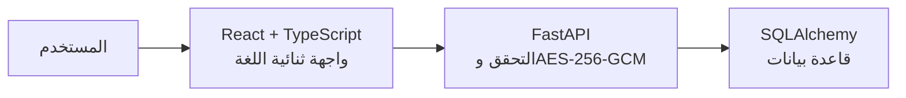

# OneSecret

> منصة ويب ثنائية اللغة لمشاركة رسالة نصية حساسة برابط زمني قصير، مع تشفير أثناء التخزين وخيارات وصول واضحة.

[](./frontend) [](./backend) [](./backend) [](./frontend) [](./backend/app/crypto.py)

## الفكرة

OneSecret أداة بسيطة لمشاركة معلومة لا يراد بقاؤها متاحة طويلًا، مثل رمز دخول مؤقت أو كلمة مرور أو ملاحظة خاصة. يكتب المرسل الرسالة، يحدد وقتًا للرابط، ثم يرسل رابطًا عشوائيًا إلى المستلم. لا تحفظ قاعدة البيانات النص بصورته المقروءة.

## لقطات من التطبيق

**إنشاء رسالة**


**عرض رسالة اختبارية**


> تعرض اللقطات بيانات اختبار غير حساسة فقط.

## ما يقدمه V1.0

| المجال | التنفيذ |
|---|---|
| الرسالة | نص حتى 10,000 حرف |
| الحماية أثناء التخزين | AES-256-GCM داخل Python؛ لا يحفظ `plaintext` في قاعدة البيانات |
| الرابط | معرّف عشوائي داخل `/s/{id}` |
| الصلاحية | يعمل الرابط عدة مرات حتى `expires_at`، من دقيقة إلى 24 ساعة |
| الإتلاف | خيار اختياري لإتلاف السر بعد أول فتح، منفذ ذريًا في الخادم |
| Secret Code | اختياري، مشتق بـscrypt مع salt ولا يظهر في الرابط أو التخزين كنص أصلي |
| تجربة الهاتف | مشاركة النظام الأصلية عند دعم Web Share API، مع زر نسخ منفصل |

## نموذج الحماية

المشروع يتبع نموذج **خادم موثوق**: خادم Python يرى النص لحظيًا كي يشفّره عند الإنشاء ويفكّه عند العرض، لكنه لا يخزن النص الأصلي أو مفتاح AES في قاعدة البيانات. لا يدعي المشروع تشفيرًا طرفًا إلى طرف، ولا يستطيع منع نسخ المحتوى أو تصوير الشاشة بعد عرضه.

## المعمارية



## الجودة

| الأمر | النتيجة في اعتماد V1.0 |
|---|---|
| `cd backend && pytest -q` | 65 اختبارًا ناجحًا |
| `cd frontend && pnpm check` | ناجح |
| `cd frontend && pnpm build` | ناجح |
| فحص يدوي | العربية والإنجليزية، الكشف المتكرر، الانتهاء، Secret Code، والإتلاف |

## التشغيل محليًا

```bash
# خادم Python
cd backend
python3 -m venv .venv
source .venv/bin/activate
pip install -r requirements.txt
export ONESECRET_ENCRYPTION_KEY="$(python generate_key.py)"
export DATABASE_URL="sqlite:///./onesecret-dev.db"
uvicorn app.main:app --reload --port 8001 --no-access-log

# واجهة React — في طرفية أخرى
cd frontend
pnpm install --frozen-lockfile
pnpm dev
```

## التوثيق

يوثق مجلد [`docs/`](./docs) طريقة بناء المشروع خطوة بخطوة: البيئة، جدول البيانات، AES-GCM، مسارات FastAPI، الواجهة، تدقيق الأمان، وخارطة الطريق.

## حقوق الاستخدام

المستودع عام للعرض الأكاديمي والمحفظة المهنية، ولا يرفق رخصة مفتوحة. لا يمنح ذلك تلقائيًا إذنًا لإعادة استخدام الشيفرة أو توزيعها أو إنشاء عمل مشتق منها [1]. العلنية لا تمنع الاطلاع أو الـfork أو الـclone، لذلك لا تضع أي سر أو بيانات حقيقية في commit عام.

**صاحب المشروع:** Alhareith Aldahia

## مرجع

[1]: https://docs.github.com/articles/licensing-a-repository "GitHub Docs: Licensing a repository"
