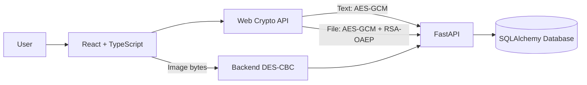

# OneSecret

> منصة تعليمية لتطبيق مفاهيم التشفير على مشاركة **النصوص والملفات والصور** داخل تطبيق ويب واحد.

## حالة المشروع

الفرع `main` يحتوي حاليًا على المعمارية المرشحة للإصدار الكبير التالي من OneSecret. آخر إصدار منشور ما زال `v1.2.1`، لذلك لا نغيّر رقم الإصدار إلى `2.0.0` قبل إكمال التنظيف الأمني والتوثيق والاختبارات النهائية.

التقنيات الأساسية:

- Frontend: React + TypeScript + Tailwind CSS + Vite.
- Backend: Python + FastAPI + SQLAlchemy.
- Text: AES-256-GCM عبر Web Crypto داخل المتصفح.
- Files: AES-256-GCM + RSA-OAEP/SHA-256 عبر Web Crypto داخل المتصفح.
- Images: Single DES-CBC + PKCS#7 داخل Backend لأغراض تعليمية.

## خريطة التشفير الحالية

| نوع البيانات | الخوارزمية | مكان التشفير | ما يصل إلى الخادم | مادة فك التشفير |
|---|---|---|---|---|
| النص | AES-256-GCM | المتصفح | `ciphertext + nonce + metadata` | مفتاح AES داخل URL Fragment `#k=` |
| الملف | AES-256-GCM + RSA-OAEP/SHA-256 | المتصفح | encrypted file envelope فقط | RSA private key + claim token داخل URL Fragment |
| الصورة | Single DES-CBC + PKCS#7 | Backend | الصورة الأصلية تصل إلى API ثم تُشفّر | مفتاح DES يعاد للواجهة ولا يُحفظ في قاعدة البيانات |

### النصوص

عند إنشاء رسالة، يولد المتصفح مفتاح AES عشوائيًا بطول 32 بايت وNonce بطول 12 بايت، ثم يشفر النص باستخدام AES-256-GCM قبل أول طلب شبكة. الخادم يخزن الحزمة المشفرة ولا يحتاج إلى مفتاح AES. رابط المشاركة يحمل المفتاح داخل الجزء الذي يلي `#`، وهذا الجزء لا يرسله المتصفح تلقائيًا في طلب HTTP العادي.

### الملفات

الملف لا يُشفّر مباشرةً بـRSA. ينشئ المتصفح مفتاح AES-256 عشوائيًا ويستخدمه لتشفير محتوى الملف بـAES-GCM، ثم يشفر مفتاح AES نفسه باستخدام RSA-OAEP/SHA-256 ومفتاح RSA عام مولد للعملية. المفتاح الخاص RSA يبقى داخل رابط المشاركة. باختصار:

> **AES يشفر الملف، وRSA يحمي مفتاح AES.**

### الصور

مسار الصور مختلف عمدًا: يتم إرسال الصورة الأصلية إلى Backend، وتُعامل كبايتات ثم تُشفّر باستخدام Single DES في وضع CBC مع PKCS#7. الخادم يخزن الحزمة المشفرة مؤقتًا، بينما مفتاح DES لا يُحفظ في قاعدة البيانات ويكون داخل رابط المشاركة.

> DES خوارزمية قديمة وغير مناسبة كنظام تشفير حديث. وجودها في OneSecret تعليمي لتطبيق ما دُرس في المقرر، ولا يُعرض المشروع على أنها بديل أمني حديث لـAES.

## حدود الثقة بدقة

لا نستخدم وصفًا عامًا مثل “Zero Knowledge” للمشروع كله لأن هذا سيكون غير دقيق.

- **Text:** الخادم لا يحتاج plaintext ولا مفتاح AES في المسار الحالي.
- **Files:** الخادم لا يحتاج bytes الملف الأصلية ولا RSA private key في المسار الحالي.
- **Images:** Backend يرى bytes الصورة الأصلية أثناء تشفير DES.
- HTTPS يظل مطلوبًا لحماية النقل والـmetadata والطلبات نفسها.
- من يملك رابطًا كاملًا يحتوي مادة فك التشفير يستطيع استخدامه ضمن صلاحية المشاركة.
- النظام لا يستطيع منع المستلم من نسخ المحتوى أو تصويره بعد فك التشفير.

راجع [`SECURITY.md`](./SECURITY.md) للنموذج الأمني والقيود التشغيلية.

## المعمارية



المسارات الأساسية في الواجهة:

```text
/                  إنشاء نص مشفر
/s/{id}            استقبال النص
/rsa-file          إرسال ملف Hybrid
/f/{id}            استقبال الملف
/des-image         إرسال صورة DES
/i/{id}            استقبال الصورة
/cancel            إلغاء مشاركة نص عند توفر رمز الإلغاء
```

الملفات الأساسية:

```text
frontend/src/lib/browser-crypto.ts        Web Crypto للنصوص والملفات
frontend/src/lib/client-crypto-api.ts     API للحزم المشفرة
frontend/src/pages/CreateSecretPage.tsx   إنشاء النص
frontend/src/pages/RevealSecretPage.tsx   استقبال النص
frontend/src/pages/RsaFilePage.tsx        إرسال الملفات Hybrid
frontend/src/pages/RsaFileReceivePage.tsx استقبال الملفات
frontend/src/pages/DesImagePage.tsx       إرسال الصور
frontend/src/pages/DesImageReceivePage.tsx استقبال الصور

backend/app/client_crypto_core.py         نماذج وتحقق للحزم المشفرة
backend/app/client_crypto_text_api.py     مشاركة النص المشفر
backend/app/client_crypto_file_api.py     مشاركة الملف المشفر
backend/app/des_image_api.py              مسار الصور DES
backend/app/crypto_des.py                 منطق DES الخام
backend/app/main.py                       نقطة تشغيل FastAPI
```

توجد كذلك مسارات Server-side أقدم للتوافق مع روابط سابقة. هي ليست المعمارية التي يجب استخدامها لشرح المسارات الجديدة، وسيتم تقييمها وعزلها أو حذفها في مرحلة تنظيف لاحقة قبل إصدار V2.

## التشغيل المحلي

### المتطلبات المعتمدة حاليًا

- Python 3.12 هو الإصدار الذي تختبره GitHub Actions حاليًا.
- Node.js 22.
- pnpm 10.
- SQLite للتطوير المحلي، وMySQL/TiDB متاحان للتشغيل الفعلي.

### Windows CMD — Backend

```cmd
cd /d "D:\4-th\التشفير وأمنية المعلومات\المشروع\OneSecret\backend"
python -m venv .venv
.venv\Scripts\activate
python -m pip install -r requirements.txt

for /f "delims=" %K in ('python generate_key.py') do set "ONESECRET_ENCRYPTION_KEY=%K"
set "DATABASE_URL=sqlite:///./onesecret-dev.db"
set "ONESECRET_REQUIRE_CONFIGURATION=true"

python -m uvicorn app.main:app --reload --host 127.0.0.1 --port 8001 --no-access-log
```

> عند التشغيل المعتاد لا تولد مفتاح `ONESECRET_ENCRYPTION_KEY` جديدًا كل مرة إذا كانت لديك بيانات Legacy تحتاج فكها. احفظ المفتاح محليًا خارج Git وأعد استخدامه. الحاجة الحالية لهذا المفتاح سببها طبقة التوافق القديمة Server-side؛ مسارا Text وFiles الجديدان لا يرسلان مفاتيح فك المحتوى إلى Backend.

اختبار الصحة:

```text
http://127.0.0.1:8001/api/health
```

والنتيجة المتوقعة بعد نجاح التهيئة:

```json
{"status":"ok"}
```

### Windows CMD — Frontend

افتح Terminal جديدًا:

```cmd
cd /d "D:\4-th\التشفير وأمنية المعلومات\المشروع\OneSecret\frontend"
pnpm install --frozen-lockfile
pnpm dev
```

يفتح Vite عادةً على `http://localhost:5173` ويمرر `/api` إلى FastAPI على المنفذ 8001.

### Linux / macOS — Backend

```bash
cd backend
python3.12 -m venv .venv
source .venv/bin/activate
python -m pip install -r requirements.txt
export ONESECRET_ENCRYPTION_KEY="$(python generate_key.py)"
export DATABASE_URL="sqlite:///./onesecret-dev.db"
export ONESECRET_REQUIRE_CONFIGURATION=true
python -m uvicorn app.main:app --reload --host 127.0.0.1 --port 8001 --no-access-log
```

### Linux / macOS — Frontend

```bash
cd frontend
pnpm install --frozen-lockfile
pnpm dev
```

## الاختبارات والجودة

Backend:

```bash
cd backend
pytest -q
```

Frontend:

```bash
cd frontend
pnpm check
pnpm build
```

GitHub Actions تنفذ بوابة الجودة على `push` و`pull_request`. التشفير داخل المتصفح أصبح جزءًا أساسيًا من النظام؛ لذلك ستضيف مرحلة نهائية لاحقة اختبارات Frontend مباشرة لـWeb Crypto بدل الاعتماد على TypeScript/build فقط.

## بنية المستودع

```text
OneSecret/
├── frontend/               React + TypeScript + Web Crypto
├── backend/                FastAPI + SQLAlchemy + DES/compatibility
├── docs/                   التوثيق الحالي + وثائق تاريخية للمراحل السابقة
├── .github/workflows/      بوابة الجودة
├── SECURITY.md             حدود الثقة والأمان
├── CONTRIBUTING.md         قواعد التعديل والمساهمة
└── PROJECT_PLAN.md         خطة تثبيت V2 قبل الإصدار
```

## التوثيق

ابدأ من:

- [`docs/README.md`](./docs/README.md) — خريطة التوثيق وما هو حالي وما هو تاريخي.
- [`docs/19-v2-finalization.md`](./docs/19-v2-finalization.md) — لقطة المعمارية الحالية وخطة التثبيت.
- [`SECURITY.md`](./SECURITY.md) — نموذج الأمان وحدود الثقة.
- [`CHANGELOG.md`](./CHANGELOG.md) — الإصدارات المنشورة السابقة.

## ملاحظة عن الإصدار

لا يُنشأ Tag أو Release باسم `v2.0.0` قبل اجتياز مراحل التثبيت التالية: نقل حماية التخمين إلى Client Crypto، تشديد تحقق صور DES، تقرير مصير Legacy APIs، إضافة اختبارات Web Crypto، تنظيف الاعتماديات والتوثيق، ثم نجاح CI النهائي.

**OneSecret = Encrypt → Share → Recover**
