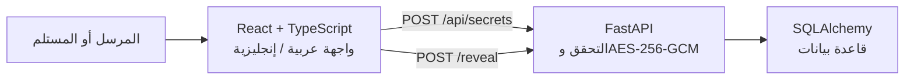
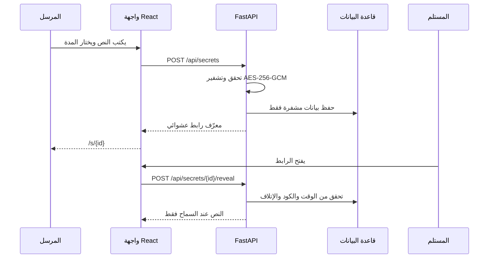

# OneSecret

> **منصة ويب ثنائية اللغة لمشاركة رسالة نصية حساسة برابط زمني قصير، مع تشفير أثناء التخزين وخيارات وصول واضحة.**

[](./frontend) [](./backend) [](./backend) [](./frontend) [](./backend/app/models.py) [](./backend/app/crypto.py)

**OneSecret** منصة تركز على مشكلة صغيرة وواضحة: مشاركة معلومة لا ينبغي أن تبقى متاحة إلى الأبد، مثل رمز دخول مؤقت أو كلمة مرور لمرة واحدة أو ملاحظة خاصة. يكتب المرسل الرسالة، يحدد مدة الرابط، ثم يشارك رابطًا قصيرًا مع المستلم. لا تُحفظ الرسالة كنص مقروء في قاعدة البيانات.

## لقطات من التطبيق

**واجهة إنشاء الرسالة**


**واجهة المستلم بعد الكشف التلقائي**


> اللقطتان من تشغيل فعلي للتطبيق وتعرضان بيانات اختبار غير حساسة فقط.

## الفكرة والقيمة

ليست الفكرة «دردشة جديدة»، ولا بديلًا عن تطبيقات التواصل. هي أداة مستقلة لرسالة لها **مدة واضحة** وسلوك وصول محدد. يرسل الشخص الرابط عبر القناة التي يفضلها، ويفتحه المستلم ليقرأ الرسالة خلال الفترة التي اختارها المرسل.

| الحاجة الواقعية | كيف يعالجها OneSecret |
|---|---|
| إرسال رمز أو كلمة مرور مؤقتة | يحدد المرسل عمر الرابط من دقيقة إلى 24 ساعة |
| تقليل خطر حفظ النص المقروء في قاعدة البيانات | يشفّر الخادم النص بـ AES-256-GCM ويحفظ `ciphertext` بدل `plaintext` |
| السماح بالعودة إلى الرسالة عند الحاجة | الرابط يعمل عدة مرات حتى وقت الانتهاء افتراضيًا |
| جعل الرسالة لمرة واحدة عند الحاجة | خيار صريح: «إتلاف بعد أول فتح» ينفذ ذريًا في الخادم |
| إضافة طبقة معرفة مشتركة | Secret Code اختياري يمر في جسم `POST` ولا يدخل الرابط أو التخزين كنص أصلي |
| إلغاء رابط وصل إلى جهة غير مقصودة | رمز إلغاء خاص بالمرسل يعطل الرابط ويمسح مواده الحساسة عند النجاح |
| تقليل التخمين والإساءة | حدود طلبات للإنشاء والكشف ومحاولات Secret Code الخاطئة |

## الوعد الأمني بدقة

OneSecret يتبع نموذج **خادم موثوق**. يرى خادم Python النص لحظيًا لتشفيره عند الإنشاء وفكه عند الكشف، لكنه لا يحفظ النص الأصلي أو مفتاح AES في قاعدة البيانات. لا يقدّم المشروع تشفيرًا طرفًا إلى طرف، ولا يدّعي منع نسخ النص أو تصوير الشاشة بعد عرضه.

| ما يحميه المشروع | ما لا يستطيع ضمانه |
|---|---|
| تشفير المحتوى في قاعدة البيانات باستخدام AES-256-GCM والتحقق من العبث [1] | جهاز المستلم المصاب أو لقطة الشاشة أو نسخ النص بعد عرضه |
| Secret Code ورمز الإلغاء مشتقان بـ scrypt مع salt عشوائي، من دون حفظ النص الأصلي | حذف نص أو لقطة شاشة وصلت إلى مستلم قبل نجاح الإلغاء |
| انتهاء الرابط عند `expires_at`، وإتلاف اختياري بعد أول فتح | حذف نسخ خارج النظام أو من ذاكرة جهاز المستخدم |
| `no-store` لصفحات الرابط ونتائج الكشف، مع رؤوس متصفح تقلل التخزين والتضمين غير اللازم [2] | جعل الرابط العام غير قابل للنسخ أو التنزيل |
| رسائل خطأ عامة وحدود محاولات للتحقق من الأسرار [2] [3] | حد موحد بين عدة نسخ خادم أو بعد إعادة تشغيله في الإصدار الحالي |

## المعمارية

تنقسم المنصة إلى ثلاث طبقات صغيرة ومباشرة، لكل منها مسؤولية واضحة وحدود محددة.



| الطبقة | المسؤولية | الملفات الأساسية |
|---|---|---|
| الواجهة | إدخال الرسالة، اختيار المدة، المشاركة الأصلية للهاتف، وعرض حالات الرابط | `frontend/src/pages/` و`frontend/src/lib/` |
| خادم Python | التشفير وفك التشفير، دورة حياة السر، Secret Code، وحدود الطلبات والرؤوس | `backend/app/` |
| البيانات | تعريف نموذج السر وجلسات SQLAlchemy | `backend/app/models.py` و`backend/app/database.py` |

## دورة حياة الرسالة



## الإصدار الحالي: V1.2.0

يضيف الإصدار **V1.2.0** قدرة إلغاء الرابط من المرسل من دون حساب أو جلسة. عند إنشاء الرسالة يعيد الخادم رمز إلغاء عشوائيًا للمرسل مرة واحدة فقط. يُحفظ منه salt واشتقاق `scrypt` فقط، ويُستخدم لاحقًا في صفحة `/cancel` لتعطيل الرابط ذريًا ومسح مواد الرسالة. لا يدخل الرمز في الرابط أو السجلات أو حالة الرابط، ولا يستطيع الإلغاء إزالة نسخة وصل إليها المستلم قبل نجاحه.

| مجال التحصين | التنفيذ |
|---|---|
| إنشاء الرسائل | 6 طلبات خلال 10 دقائق لكل مصدر اتصال |
| Reveal | 60 طلبًا خلال دقيقة لكل مصدر اتصال |
| Secret Code الخاطئ | 5 محاولات خلال 10 دقائق لكل مصدر ولكل رسالة |
| مفاتيح ذاكرة المحدد | بصمات HMAC للنطاق والمصدر؛ لا تحفظ `secret_id` أو المصدر خامًا |
| تنظيف الذاكرة | حذف المفاتيح المنتهية دوريًا بدل تراكمها |
| رد الحظر | `429` مع `Retry-After` ورسالة واجهة عربية/إنجليزية عامة |
| منع التخزين | `Cache-Control: no-store` لمسار الرابط، وحالة الرابط، وكل نتائج Reveal الحساسة |
| سجل التشغيل | تعطيل سجل الوصول الافتراضي في تشغيل الإنتاج، مع حدث حظر مختصر خالٍ من المحتوى |
| رمز الإلغاء | قيمة عشوائية خاصة بالمرسل، تعرض مرة واحدة وتُخزن مشتقة فقط |
| الإلغاء | `POST` بجسم طلب، تحديث ذري، ومسح بيانات التشفير وSecret Code ومواد الإلغاء |
| الرابط الملغى | كشف وحالة عامة غير متاحة للمستلم، مع `no-store` وحدود محاولات |

تفاصيل التحصين وقيوده التشغيلية موجودة في [`docs/13-v1-1-hardening-design.md`](./docs/13-v1-1-hardening-design.md)، ويوثق [`docs/16-v1-2-cancellation-design.md`](./docs/16-v1-2-cancellation-design.md) عقد الإلغاء وحدوده واختباراته.

## الجودة والتحقق

تغطي الاختبارات السلوك الأساسي وحالات الخطأ والتحصين التشغيلي وإلغاء الرابط. النتائج الحالية موثقة في V1.2.

| الأمر | ما الذي يتحقق منه | آخر نتيجة |
|---|---|---|
| `cd backend && pytest -q` | التشفير، دورة حياة السر، الصلاحية، Secret Code، الإلغاء الذري، التزامن، الحدود والرؤوس | **81 passed** |
| `cd frontend && pnpm check` | صحة أنواع TypeScript | ناجح |
| `cd frontend && pnpm build` | بناء واجهة الإنتاج Vite | ناجح |
| Vitest | تحليل رابط الإلغاء محليًا ومنع طلب كشف مكرر | **4 passed** |
| فحص HTTP ومتصفح | حالات الإلغاء الصحيح والخاطئ و`200` و`401` و`410` و`429`، رؤوس الحماية، وسجل تشغيل آمن | ناجح |

كما تحتوي المستودع على بوابة GitHub Actions في [`.github/workflows/quality.yml`](./.github/workflows/quality.yml) لفحص الواجهة وخادم Python عند كل push أو pull request.

## التشغيل محليًا

### المتطلبات

| الأداة | النسخة المقترحة |
|---|---:|
| Python | 3.12 أو أحدث ضمن 3.x |
| Node.js | 22 |
| pnpm | 10 |
| قاعدة البيانات | SQLite للتطوير والاختبارات، وMySQL/TiDB للتشغيل الفعلي |

### 1. تشغيل خادم Python

```bash
cd backend
python3 -m venv .venv
source .venv/bin/activate
pip install -r requirements.txt

# اطبع مفتاح AES-256 جديدًا محليًا واحفظه خارج المستودع.
export ONESECRET_ENCRYPTION_KEY="$(python generate_key.py)"
export DATABASE_URL="sqlite:///./onesecret-dev.db"

uvicorn app.main:app --reload --port 8001 --no-access-log
```

### 2. تشغيل واجهة React

```bash
cd frontend
pnpm install --frozen-lockfile
pnpm dev
```

بعد ذلك افتح الرابط الذي تعرضه Vite. تمرّر بيئة التطوير طلبات `/api` إلى خادم FastAPI على المنفذ `8001`.

> لا تضع `ONESECRET_ENCRYPTION_KEY` أو أي قيمة اعتماد في ملف متتبع داخل Git أو لقطة شاشة أو issue عام.

## بنية المستودع

```text
OneSecret/
├── frontend/               # React + TypeScript + Tailwind + Vite
│   └── src/
│       ├── pages/          # CreateSecretPage وRevealSecretPage
│       └── lib/            # API وi18n ومخزن منع الطلب المكرر
├── backend/                # FastAPI + SQLAlchemy + cryptography
│   ├── app/                # منطق التشفير والأسرار والـAPI والحماية
│   └── tests/              # اختبارات pytest
├── docs/                   # توثيق كل مرحلة وقراراتها
├── .github/workflows/      # بوابة الجودة العامة
└── todo.md                 # سجل التنفيذ ومعايير القبول
```

## التوثيق التقني

يوثق مجلد [`docs/`](./docs) البيئة وقاعدة البيانات وAES-GCM ومسارات API وواجهات المستخدم والنشر والتدقيق والصلاحية وSecret Code وتحسينات V1.1. يربط كل قرار تقني بنطاقه واختباراته وقيوده التشغيلية.

| الوثيقة | التركيز |
|---|---|
| [`docs/03-crypto.md`](./docs/03-crypto.md) | تطبيق AES-256-GCM والـNonce والتحقق من العبث |
| [`docs/04-api-lifecycle.md`](./docs/04-api-lifecycle.md) | إنشاء السر وReveal وحالات الانتهاء والإتلاف الذري |
| [`docs/11-expiry-secret-code-design.md`](./docs/11-expiry-secret-code-design.md) | العرض المتكرر حتى الانتهاء وSecret Code الاختياري |
| [`docs/13-v1-1-hardening-design.md`](./docs/13-v1-1-hardening-design.md) | حدود الطلبات والرؤوس والسجل الآمن وقيود التشغيل |
| [`docs/14-github-publication.md`](./docs/14-github-publication.md) | المستودع العام والإصدارات وبوابة الجودة ومراجعة README |
| [`docs/15-v1-1-1-release.md`](./docs/15-v1-1-1-release.md) | نطاق إصدار V1.1.1 وفحوصه والتغييرات غير الوظيفية |
| [`docs/16-v1-2-cancellation-design.md`](./docs/16-v1-2-cancellation-design.md) | رمز الإلغاء والإلغاء الذري وعقود API والحدود والاختبارات |

راجع [`CHANGELOG.md`](./CHANGELOG.md) لتفاصيل ما دخل كل إصدار منشور.

## خارطة الطريق

| المرحلة | القرار |
|---|---|
| V1.0 | الرسائل النصية المؤقتة، AES-256-GCM، الصلاحية، الإتلاف الاختياري، Secret Code، وتجربة الهاتف |
| V1.1 | تحصين تشغيلي مكتمل: حدود إساءة الاستخدام وسجل آمن ورؤوس متصفح |
| V1.1.1 | صيانة موثقة: بوابة جودة مستقرة وREADME تقني محايد بلا تغيير وظيفي |
| V1.2 | مكتملة: إلغاء الرابط من المرسل برمز إلغاء منفصل ومشتق آمنًا |
| V1.3 | صورة مؤقتة واحدة بنطاق منفصل بعد V1.2، مع تحقق النوع والحجم وإزالة EXIF |

لا تدخل الحسابات أو المحادثات أو الذكاء الاصطناعي أو رفع الملفات العامة ضمن النطاق الحالي؛ لأنها ستزيد التعقيد ولا تحل المشكلة الأساسية للمرحلة الحالية.

## المساهمة والإبلاغ الآمن

المشروع معروض للمراجعة التقنية. لا تضع رسالة حقيقية أو Secret Code أو مفتاحًا أو رابطًا صالحًا في issue أو pull request. عند اكتشاف مشكلة أمنية، اكتفِ بوصف غير حساس وخطوات إعادة إنتاج تستخدم بيانات اختبار، وراجع [`SECURITY.md`](./SECURITY.md) قبل الإبلاغ.

## حقوق الاستخدام

هذا المستودع **عام للعرض والتقييم التقني**، لكنه لا يرفق رخصة مفتوحة. لا يمنح ذلك تلقائيًا إذنًا لإعادة استخدام الشيفرة أو توزيعها أو إنشاء عمل مشتق منها؛ فالحقوق الافتراضية تبقى لصاحبها عند غياب رخصة مفتوحة [4]. العلنية لا تمنع الاطلاع أو الـfork أو الـclone وفق قواعد GitHub، لذلك لا ينبغي وضع أسرار أو بيانات فعلية في أي commit عام.

**صاحب المشروع:** Alhareith Aldahia

## المراجع

[1]: https://cryptography.io/en/latest/hazmat/primitives/aead/ "توثيق cryptography الرسمي: AESGCM والتحقق من النزاهة"
[2]: https://cheatsheetseries.owasp.org/cheatsheets/REST_Security_Cheat_Sheet.html "OWASP REST Security Cheat Sheet"
[3]: https://pages.nist.gov/800-63-4/sp800-63b.html "NIST SP 800-63B"
[4]: https://docs.github.com/articles/licensing-a-repository "GitHub Docs: Licensing a repository"
